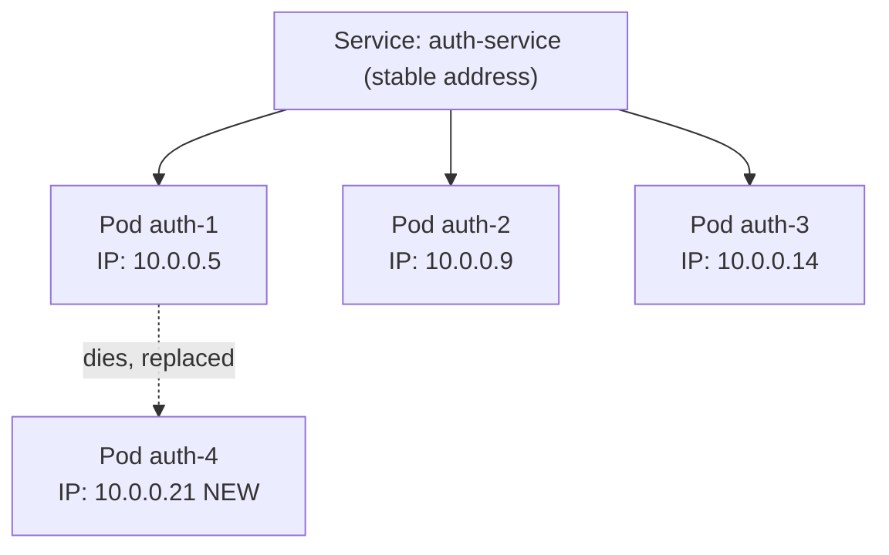
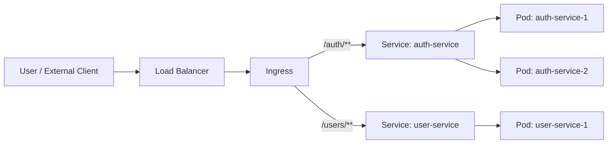
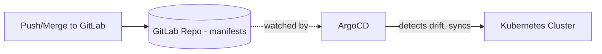

# Kubernetes @ Ecobank — My Notes

> Personal reference notes on how our dev/deployment environment fits together. Written to make sense to me six months from now, not to be a formal spec.

---

## 1. Why Kubernetes Exists in the First Place

Before the terms, the *why* — this is what made everything else click for me.

In the old world, you'd deploy an app onto a specific server. If that server died, your app died. If you needed more capacity, someone had to manually provision another server, install dependencies, configure it, and plug it into a load balancer. It was slow and very manual.

Kubernetes' job is to take a pile of machines and make them behave like **one programmable computer** that you describe your app's needs to declaratively. You say "I want 3 copies of auth-service running, each needs 512MB of RAM, and it should be reachable at this address" — and Kubernetes figures out *where* to run them, restarts them if they crash, moves them if a machine dies, and keeps that internal address pointing at whichever copies are currently healthy.

Everything below is really just: **how do I describe what I want, and how does traffic find it once it's running.**

---

## 2. The Big Picture: Cluster → Namespace → Pod

Think of it like a filing system:

```
CLUSTER (e.g. eng-eks-dev)
 └── NAMESPACE (e.g. "payments-project")
      ├── Pod: auth-service (x3 replicas)
      ├── Pod: user-service (x2 replicas)
      └── Pod: notification-service (x1 replica)
```

### Cluster
The entire environment — a set of machines (nodes) that Kubernetes manages as one unit, plus the control plane software that does the managing (the "brain" that decides where things run, watches health, etc.). When someone says "deploy this to `eng-eks-dev`," they mean this whole environment, not one machine in it.

**Clusters we use at Ecobank:**
- `eng-eks-dev` — where most of our development happens
- `sre-dev` — SRE-owned dev cluster
- Live/production clusters — e.g. for mobile app 5.0, etc.

A cluster is essentially a *boundary of trust and management*. Dev and live are separate clusters (not just separate namespaces) precisely because you want a hard wall between "things engineers experiment on" and "things real customers depend on."

### Namespace
A logical partition **inside** a cluster. It doesn't give you separate machines — it gives you a separate "zone" for naming, permissions, and resource limits, all within the same physical cluster.

Why namespaces exist, concretely:
- **Naming**: two teams can both have a service called `user-service` without colliding, because `payments-project/user-service` and `loans-project/user-service` are different addresses.
- **Access control**: your team can be given permissions scoped to only your namespace, so you can't accidentally touch another team's pods.
- **Resource quotas**: a namespace can be capped at "max 10 CPU cores, 16GB RAM" so one project can't starve the whole cluster.

Analogy: if the cluster is the office building, the namespace is your department's floor — same building, same electricity and internet backbone (the underlying nodes), but a locked door for your own stuff.

### Pod
The smallest deployable unit in Kubernetes — **one running instance** of your application (e.g. one instance of auth-service). Technically a pod can hold more than one container, but 95% of the time in a microservices setup it's one container = one pod = one instance of your service.

Important nuance I initially missed: **pods are disposable.** Kubernetes doesn't try to keep a specific pod alive forever — if it crashes or the node it's on dies, Kubernetes just kills it and creates a *brand new* pod with a *brand new IP address* to replace it. It doesn't "heal" the old one. This single fact is *why* Services need to exist (see Section 4) — you can never rely on a pod's IP staying the same.

You'll also hear "replicas" — if auth-service has 3 replicas, that means 3 identical pods are running simultaneously, all doing the same job, so traffic can be spread across them and if one dies the other two keep serving requests without downtime.

### Node
A single machine — physical or virtual — that actually runs your pods. It has real CPU, RAM, and storage, plus a few background components (kubelet, container runtime, kube-proxy) that let it take orders from the cluster's control plane. A node can be a bare-metal server, a VM (on-prem via VMware, or cloud via an EC2 instance), or even your own laptop if you're running something like Minikube locally — Kubernetes treats them all the same.

```
CLUSTER
 ├── Node 1 → runs Pod A, Pod D
 ├── Node 2 → runs Pod B, Pod E
 └── Node 3 → runs Pod C, Pod F
```

A pod can't exist without landing on *some* node — the scheduler (part of the control plane) picks which node gets which pod based on available resources.

**Depth I actually need on this, as a SWE:** just the definition above. On cloud-managed clusters like ours, the platform/infra team handles node provisioning, patching, and scaling — I don't manage nodes directly. The one practical thing worth knowing: a Service load-balances across pods *regardless of which node they're on* — nodes are an infra-layer detail, not something my application code or deployment configs need to reference.

---

## 3. Services — the piece I was missing

This is the term I skipped last time, and it's actually the hinge that makes everything else make sense.

### The problem Services solve
Say `user-service` needs to call `auth-service`. The naive approach: hardcode auth-service's pod IP address. But as covered above, pods die and get replaced constantly, each time with a **new IP**. If you hardcoded an IP, your app would break every time Kubernetes replaced a pod — which could be minutes after you deployed.

### The solution
A **Service** is a stable, permanent internal address that sits in front of a group of pods doing the same job. It doesn't run any code itself — it's essentially a standing rule that says: "traffic to `auth-service:8080` should be load-balanced across whichever `auth-service` pods are currently healthy, right now."



Concretely, this means:
- Kubernetes automatically gives every Service a **DNS name** (via an internal component called CoreDNS) — so `user-service`'s code can just call `http://auth-service:8080/login` and it works, forever, no matter how many times the underlying pods are replaced.
- The Service keeps an always-current list of which pods are healthy right now, and load-balances requests across them.
- This happens **automatically the moment you create a Service** — you don't configure any registry or heartbeat mechanism yourself. That's the exact reason Eureka becomes unnecessary here (more in Section 5).

### Types of Services (good to at least recognize)
- **ClusterIP** (default) — only reachable *from inside* the cluster. Most internal service-to-service calls use this.
- **NodePort** — exposes the service on a fixed port on every node; more of a low-level/legacy way to expose things externally.
- **LoadBalancer** — provisions an actual external load balancer (via the cloud provider) pointing at the service. Common for public-facing entry points.

In practice at Ecobank, most of my services will likely be `ClusterIP` (internal-only, since Ingress handles the external-facing part).

**One-line definition to remember:** *A Service is a stable name and address for a group of interchangeable pods, so nothing ever has to know or care about individual pod IPs.*

---

## 4. How a Request Actually Reaches a Pod (full flow)

Now that Services make sense, here's the complete path a request takes from the outside world down to actual running code:



Step by step:
1. **Load Balancer** — the actual entry point at the network level, usually provisioned by the cloud provider. It just forwards raw traffic into the cluster.
2. **Ingress** — a set of *routing rules*. It looks at the incoming request's hostname and path and decides which Service it belongs to. E.g. "anything hitting `api.ecobank.com/auth/*` goes to the `auth-service` Service." It's also typically where TLS/HTTPS termination happens — i.e. it decrypts HTTPS traffic once at the edge so individual pods don't each have to handle certificates.
3. **Service** — takes that traffic and load-balances it across whichever pods are currently healthy for that group, using the always-up-to-date pod list described in Section 3.
4. **Pod** — the actual running instance of your code that handles the request.

**The one-line distinction that finally makes this click:**
> *Ingress decides which Service a request should go to, based on the URL. The Service decides which specific pod handles it, based on health.*

Ingress = routing by URL, done once, at the door.
Service = load-balancing by health, continuously, at the pod level.

---

## 5. Ingress vs. API Gateway vs. Eureka — do I need all of them?

This came up talking to my EM. Now that Services and Ingress are both clear, here's the fuller answer.

### Service Discovery (Eureka) → Kubernetes replaces this outright
In a traditional Spring Cloud setup without Kubernetes, there's no built-in mechanism for one service to find another's current address — so Eureka exists as a **registry**: each service instance "registers itself" with Eureka on startup (`"hey, I'm auth-service, I'm at 10.0.0.5:8080"`), sends periodic heartbeats to prove it's still alive, and other services ask Eureka *"where is auth-service right now?"* before calling it.

Kubernetes Services do exactly this job, natively, with zero extra code:
- Registration → automatic, based on which pods match the Service's label selector.
- Heartbeats/health checks → Kubernetes already tracks pod health via liveness/readiness probes.
- Lookup → just a DNS name (`auth-service`), no client library or registry call needed.

➡️ **If deploying to this cluster, I don't need to run Eureka.** Running it anyway would mean maintaining a second, redundant discovery system on top of one Kubernetes already runs for free — more moving parts, more things that can drift out of sync, no extra benefit.

### API Gateway → depends on what I actually need
Ingress and a dedicated API Gateway overlap, but they're not solving identical problems. Ingress is a *routing layer*; a Gateway is often also a *policy and transformation layer*.

| Capability | Ingress | Dedicated API Gateway (Spring Cloud Gateway, Kong, etc.) |
|---|---|---|
| Route by host/path | ✅ | ✅ |
| TLS termination | ✅ | ⚠️ Sometimes |
| Request/response transformation (e.g. reshape a payload) | ❌ | ✅ |
| Aggregating multiple backend calls into one response | ❌ | ✅ |
| Fine-grained per-client rate limiting/auth policies | ⚠️ Limited (depends on the Ingress controller installed) | ✅ |
| Business-logic-aware routing (e.g. route by user tier) | ❌ | ✅ |

➡️ **If my needs are simple routing (path/host → service), Ingress alone is enough**, and adding a separate gateway would just be redundant infrastructure. Only reach for a dedicated Gateway pod if I hit something Ingress genuinely can't do — and even then, that Gateway is just *another pod* that Ingress routes traffic *to*. It doesn't replace Ingress; it sits behind it.

---

## 6. What I Actually Need to Know (as a Backend Dev) — Depth Cheat Sheet

Kubernetes has a *lot* of surface area, and it's easy to feel like I need to master all of it. I don't. Here's the honest breakdown of what deserves my attention vs. what I can safely leave to the platform/infra/SRE team:

| Topic | Do I need it? | Why |
|---|---|---|
| Pods | ✅ Yes | That's my app actually running |
| Services | ✅ Yes | How my app talks to others |
| Deployments | ✅ Yes | How I describe/update what should be running (see YAML below) |
| ConfigMaps / Secrets | ✅ Yes | How config values and credentials get injected into my pods |
| Ingress | ✅ Yes | How external traffic reaches my app |
| Nodes | ⚠️ Basic only | Just know they're the machines pods run on — not something I configure |
| kube-proxy | ❌ No | Internal networking plumbing — it just works |
| CNI / networking plugins | ❌ No | Infra/ops territory |
| etcd | ❌ No | Just know it's where the cluster stores its own state |
| Scheduler internals | ❌ No | Ops manages this, I don't need to influence pod placement manually |

**The mindset shift that helped this click:** before Kubernetes, you'd SSH into a specific server and think "which machine is my app on?" With Kubernetes, you **declare what you want** (3 replicas, this image, these env vars) and the cluster figures out the rest. My job is writing good code, a clean Dockerfile, and correct config — not being a cluster admin.

### What a Deployment actually looks like

I hadn't actually seen the shape of this yet, so — this is roughly 90% of what I'll interact with day to day. A **Deployment** is the object that describes "I want N copies of this container running," and it's usually paired with a **Service** so other things can reach it:

```yaml
apiVersion: apps/v1
kind: Deployment
metadata:
  name: order-service
spec:
  replicas: 3
  template:
    spec:
      containers:
      - name: app
        image: myapp:latest
        env:
        - name: DB_URL
          valueFrom:
            secretKeyRef:
              name: order-service-secrets
              key: db-url
        ports:
        - containerPort: 8080
---
apiVersion: v1
kind: Service
metadata:
  name: order-service
spec:
  selector:
    app: order-service
  ports:
  - port: 80
    targetPort: 8080
```

Reading this against everything above:
- `replicas: 3` → 3 pods, matches what "replicas" means in §2.
- `env` / `secretKeyRef` → this is a **Secret** being injected as an environment variable, instead of hardcoding a DB credential into the image. (ConfigMaps work the same way, for non-sensitive config.)
- The `Service` block's `selector: app: order-service` is *how* a Service knows which pods belong to it — it just matches pods carrying that label. This is the mechanism behind everything in §3.
- In practice, teams usually don't hand-write this raw YAML for every deploy — tools like **Helm** or **Kustomize** template/manage it, and in our case ArgoCD is what actually applies it to the cluster (§7).

### My actual day-to-day focus areas (not Kubernetes internals)
- **Health check endpoints** (e.g. `/actuator/health` for Spring Boot) — Kubernetes uses these to know if a pod is actually ready to receive traffic, or needs restarting.
- **Graceful shutdown** — so a pod finishes in-flight requests before it's terminated, instead of dropping them mid-request.
- **Resource requests/limits** (CPU/memory) — declaring how much my app actually needs, so the scheduler can place it sensibly.
- **12-factor app principles** — config via environment variables, stateless processes, etc. — Kubernetes rewards apps built this way.
- **Observability** — logs, metrics, traces — since I can't SSH in and "just look," good logging is how I actually debug something running in a pod.

Realistically: even experienced backend devs who've used Kubernetes for years often can't fully explain what `kube-proxy` does internally — and that's fine. The point isn't to become a cluster admin, it's to know enough to deploy confidently and ask the right question to the SRE/platform team when something's genuinely infra-level.

---

## 7. ArgoCD & GitOps (deployment side)

Separate from Kubernetes itself, but sits right next to it in our workflow — this is *how our code ends up running on the cluster* in the first place.



### The core idea: GitOps
**GitOps** is a philosophy where Git is treated as the single source of truth for *what should be running* — not just application code, but the actual desired state of the infrastructure (how many replicas, which image version, config values, etc.), usually written as YAML manifest files.

### What ArgoCD actually does, mechanically
1. ArgoCD is a controller running inside (or alongside) the cluster, configured to watch a specific Git repo/branch/path.
2. It continuously polls (or gets notified) and compares two things: **"what does Git say should be running"** vs. **"what is actually running in the cluster right now."**
3. If they differ — say someone merged a change bumping auth-service's image tag — ArgoCD detects that drift and automatically applies the change to the cluster to bring reality back in line with Git.
4. If someone manually changes something in the cluster directly (bypassing Git), ArgoCD will notice the drift and can revert it back to match Git — this is intentional, it enforces that Git stays authoritative.

➡️ This is why merging to the right branch triggers a deployment. **GitLab itself never talks to the cluster.** It's ArgoCD, sitting on the cluster side, noticing the Git state changed and reconciling.

*(Branching strategy notes to be added separately — see placeholder below.)*

---

## 8. Rancher — how we manage all of this

Rancher is the UI/control plane we use to interact with our clusters, instead of raw `kubectl` and juggling separate cluster configs and credentials for each one.

- One dashboard to view pods, logs, namespaces, and resource usage across `sre-dev`, `eng-eks-dev`, and the live clusters, without switching contexts manually.
- Good starting point when I want to check "is my pod actually running / what does its log say" without touching the terminal — Rancher gives a point-and-click view into most of what I'd otherwise need `kubectl get pods` / `kubectl logs` for.
- It also usually layers on role-based access control (RBAC) — i.e. it's part of how permissions per namespace/cluster get managed.

---

## 9. Messaging & Databases — confirmed with the team

Rather than assume, I asked directly — here's the actual setup at Ecobank:

- **Kafka:** There's a **central, shared Kafka cluster**. App teams are given credentials/topic access rather than deploying their own broker per project. This matches common enterprise practice — Kafka is stateful and genuinely painful to run well (replication, storage, backups), so it makes sense for one team to own it centrally rather than every project reinventing it.
- **Databases:** Hosted on our **internal server farm** (not spun up as pods per-project). Provisioned centrally, outside of Kubernetes.

➡️ Practical takeaway: when a project needs messaging or a database, the move is to **request credentials/access from the owning team**, not to deploy my own Kafka pod or database instance inside my namespace.

---

## 10. GitLab Branching Strategy

*(Placeholder — to fill in after going through this with the team in more detail.)*

---

## 11. If I want to go deeper: kubernetes.io

The official docs (https://kubernetes.io/) are written for people **building/administering** clusters — reading it cover-to-cover as a SWE is overkill and will just cause overload.

**Worth reading (directly relevant to how I work day-to-day):**
- Concepts → Workloads → Pods
- Concepts → Services, Load Balancing, and Networking → *Service* and *Ingress*
- Concepts → Configuration → ConfigMaps and Secrets (how config/credentials get injected into pods)

**Safe to skip (infra/platform team territory):**
- Cluster administration
- Scheduling internals
- Storage classes
- Networking plugins (CNI)

**Gentler starting point than the raw reference docs:** the official *"Kubernetes Basics"* interactive tutorial.

---

## Quick Glossary

| Term | One-liner |
|---|---|
| Cluster | Whole K8s environment (e.g. `eng-eks-dev`) — the "building" |
| Namespace | Logical folder inside a cluster for one project — the "floor" |
| Pod | One running, disposable instance of a service — the "desk" |
| Node | Physical/virtual machine that runs pods — know the definition, leave management to infra |
| Service | Stable internal name/address for a group of interchangeable pods; replaces manual service discovery |
| Ingress | Routes external traffic into the cluster by URL, to the right Service |
| ArgoCD | Watches Git, auto-syncs the cluster to match it (GitOps) |
| Rancher | Dashboard/control plane for managing our clusters without raw `kubectl` |
