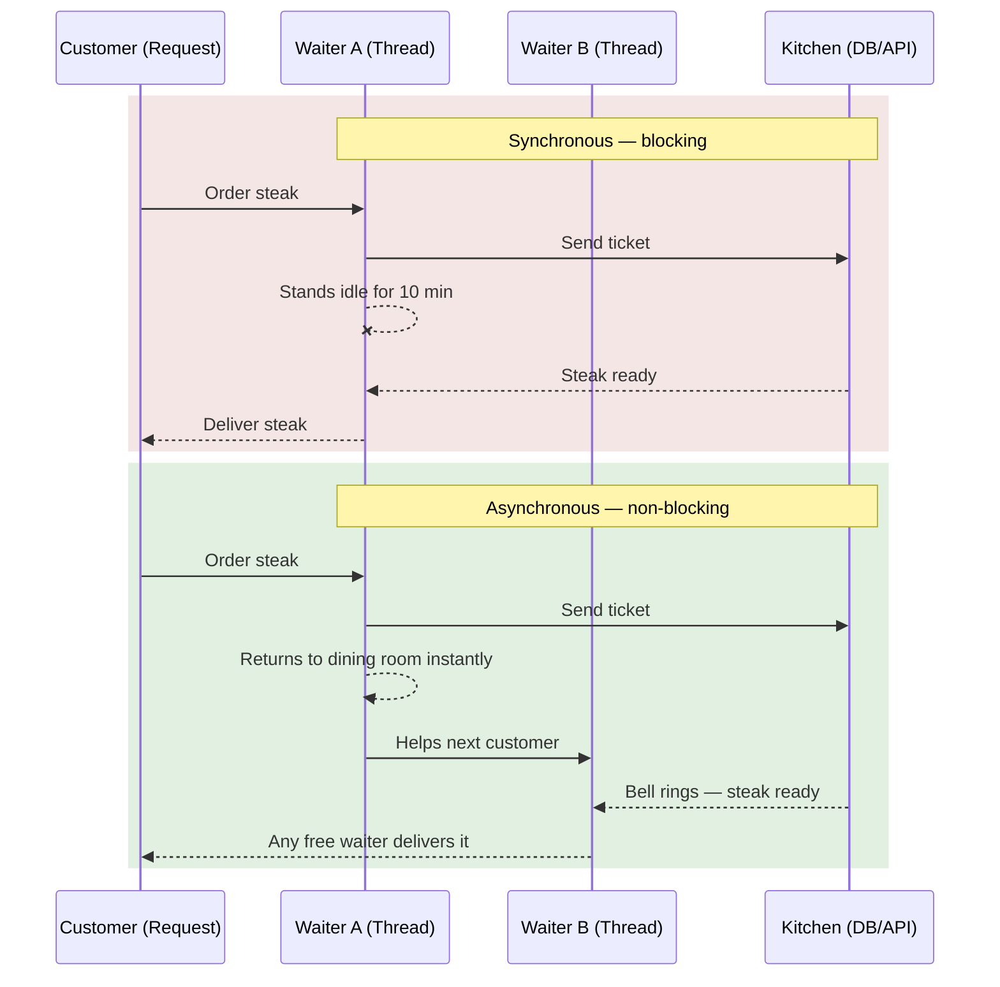
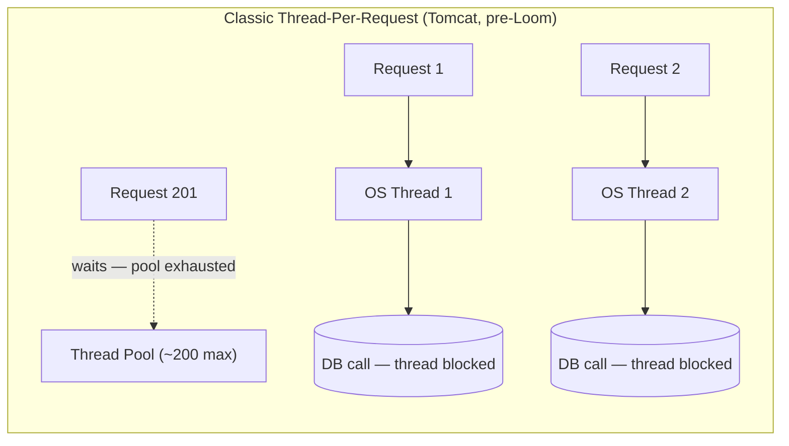
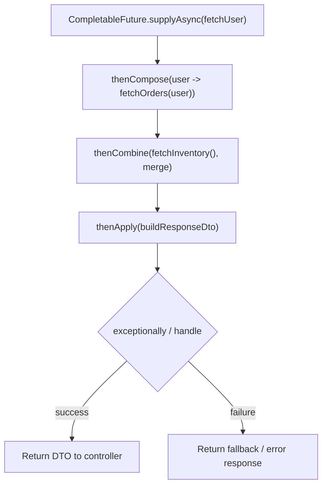
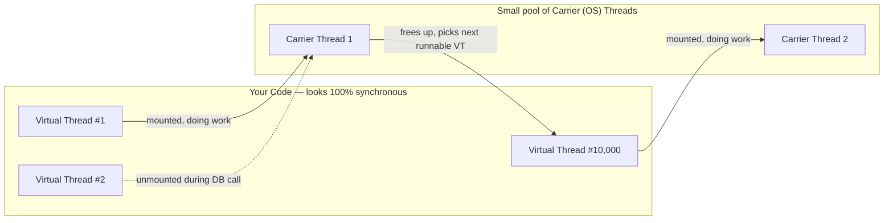
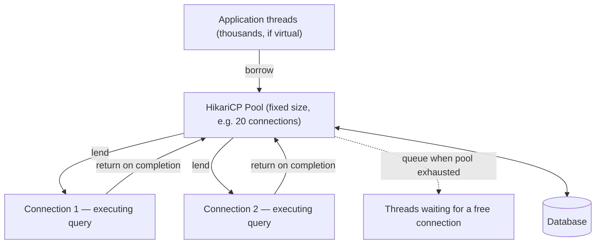

# 08 — Asynchronous Programming, Virtual Threads & Connection Pooling

## What is Asynchronous Programming?
**Synchronous (Blocking):** Execution happens one line at a time. The program stops and waits for a task (like a database save or API call) to finish before moving to the next line.

**Asynchronous (Non-Blocking):** The program starts a task, hands it off to a background thread, and immediately continues executing the next lines of code without waiting for the task to finish.

## The "Who is Waiting?" Dilemma
A common confusion is: *If I use `.thenApply()`, isn't the code still waiting for the result?*

Yes, the **code** is waiting — you can't generate a JWT until the database returns the User ID. Asynchronous programming isn't about eliminating that logical dependency; it's about **preventing the physical OS Thread from sitting idle while it waits.**

### The Restaurant Analogy
Imagine a **Customer** (API Request) and a **Waiter** (OS Thread). The Customer orders a steak that takes 10 minutes to cook.

* **Synchronous:** The Waiter takes the order, walks to the kitchen, and stands completely still for 10 minutes waiting for the steak. They are **blocked**. If 5 customers order steak, you need 5 Waiters.
* **Asynchronous:** The Waiter takes the order, drops the ticket in the kitchen, and **immediately goes back to the dining room** to help another customer. When the kitchen rings the bell, *any* available Waiter grabs the steak.



---

## How Async Works in Java (`CompletableFuture` & Virtual Threads)

Unlike Node.js, standard Java web servers (like Tomcat) traditionally use a **Thread-Per-Request** model. Tomcat gives you a pool of ~200 OS threads. When 200 users hit your API, Tomcat hands each one a dedicated thread. The 201st request has to wait for a thread to free up — this is the classic scalability ceiling of pre-Loom Java web apps.



### What is a `CompletableFuture`?
It's Java's version of a Promise — a container for a value that doesn't exist yet. Two common patterns:

1. **Fire and Forget (`runAsync`):** Toss a task in the background (like writing an audit log) and return HTTP 200 immediately, without waiting for it.
2. **Parallel Processing:** Fetch from 3 different APIs at the exact same time and combine the results once all three return.

#### Chaining methods you'll actually use

| Method | Purpose | Blocking? |
|---|---|---|
| `thenApply(fn)` | Transform the result (sync, in-line) | Runs on whichever thread completed the future |
| `thenApplyAsync(fn, executor)` | Transform the result on a specific executor | Non-blocking to caller |
| `thenCompose(fn)` | Chain another `CompletableFuture`-returning call (flatMap-style, avoids nested futures) | Non-blocking |
| `thenCombine(other, fn)` | Merge results of two independent futures | Non-blocking |
| `allOf(f1, f2, f3)` | Wait for all to finish (e.g. 3 parallel API calls) | Blocks only when you call `.join()`/`.get()` on it |
| `exceptionally(fn)` | Handle a failure and supply a fallback value | — |
| `handle(fn)` | Handle both success and failure in one callback | — |

A subtle trap: if you don't pass a custom `Executor` to the `*Async` variants, Java defaults to the shared `ForkJoinPool.commonPool()`. That pool is sized to your CPU core count — great for CPU-bound work, but a poor fit if you're firing off lots of I/O-bound calls, since you can starve other parts of the JVM (like parallel streams) that also rely on the common pool. In production Spring Boot code, it's common to define a dedicated `@Bean Executor` for this reason.



### The Game Changer: Virtual Threads (Java 21+)
The goal of Virtual Threads (Project Loom) is to **let you write boring, synchronous code that scales like asynchronous code.** No `thenApply` chains, no callback soup — just normal blocking-looking code, but cheap.

**How it actually works under the hood:**
- A Virtual Thread is not an OS thread. It's a lightweight object managed by the JVM, scheduled onto a small pool of real OS threads called **carrier threads** (by default, one per CPU core, backed by `ForkJoinPool`).
- When your code makes a blocking call recognized by the JDK (socket I/O, JDBC via a Loom-aware driver, `Thread.sleep`), the JVM captures the virtual thread's stack as a **continuation**, unmounts it from its carrier thread, and frees that carrier thread to run a different virtual thread.
- When the I/O completes, the virtual thread is re-mounted onto *any* available carrier thread and resumes exactly where it left off.

You can spin up millions of virtual threads because each one is just a small heap object (starting around a few hundred bytes) rather than a ~1MB OS thread stack.



#### Should I use Virtual Threads for EVERYTHING?
**No.** Virtual threads only help with **I/O-bound tasks** — waiting on a database, HTTP call, file system, or message queue.

They're useless (or actively harmful) for **CPU-bound tasks** — heavy math, cryptography, image processing, sorting huge in-memory lists. There's no "waiting" to unmount during; the virtual thread just occupies its carrier thread doing pure computation, so you gain nothing over a plain thread pool.

#### Pinning: the trap that quietly kills your scalability
A virtual thread can get **pinned** to its carrier thread — meaning it *cannot* be unmounted even while blocked. This happens most notably when the blocking call occurs inside a `synchronized` block or method. If 200 virtual threads all hit a `synchronized` block guarding a slow I/O call at the same time, they pin 200 carrier threads — and since you typically only have as many carrier threads as CPU cores, your server effectively degrades back to the old thread-per-request ceiling, except worse, because it's invisible until load testing reveals it.

> Practical note: this specific `synchronized`-pinning behavior has been an active area of JDK improvement since Loom's introduction, so always check the pinning behavior of the exact JDK version you're targeting rather than assuming it's fixed. In the meantime, the safe pattern is to replace `synchronized` with `java.util.concurrent.locks.ReentrantLock` in code paths that run on virtual threads and do I/O.

---

## The Database Bottleneck: Connection Pooling

If Virtual Threads let Tomcat handle 10,000 concurrent users, can your database handle 10,000 concurrent queries? **No — and this is the single most common Loom-adoption mistake.**

Opening a raw TCP connection to a database is expensive: TCP handshake, TLS negotiation, authentication, session setup. Do that per-query at scale and the database's connection-handling overhead alone will crash it, long before query execution becomes the bottleneck.

### The Solution: HikariCP (Connection Pool)
A Connection Pool is a bucket of pre-opened, always-ready, already-authenticated connections.
1. At startup, Spring Boot opens N connections to MSSQL (or Postgres/MySQL/etc.) and keeps them alive.
2. When a thread needs data, it doesn't open a connection — it borrows one from the bucket.
3. The instant the query finishes, the connection goes back in the bucket for the next borrower.



### Sizing the pool
HikariCP's own guidance (based on the widely cited "PostgreSQL numbers" formula) is a useful starting point:

```
connections = ((core_count * 2) + effective_spindle_count)
```

For a modern server on SSD storage, `effective_spindle_count` is effectively 1, so an 8-core DB server often lands around 16–20 connections. The counter-intuitive lesson: **throwing more connections at the pool past this point usually makes throughput worse**, not better — you get more context-switching and lock contention on the DB server, not more real parallelism. Pool size should be tuned against the *database's* capacity, not the application's request volume.

### The Virtual Thread Trap
If you have 10,000 Virtual Threads trying to query the database, but your Hikari Pool only has 20 connections, **9,980 Virtual Threads sit queued waiting for a connection.** This is a distinct bottleneck from the Tomcat one:

- **Virtual Threads** solve the *web server concurrency* bottleneck (accepting/handling many requests cheaply).
- **Connection Pools** solve the *database capacity* bottleneck (how many concurrent queries the DB can actually serve well).

Scaling one without the other just moves the queue — it doesn't remove it. In this case it moves the queue from "waiting for a Tomcat thread" (expensive, was the original problem) to "waiting for a Hikari connection" (cheap to queue for, since virtual threads waiting on the pool unmount too — but the *latency* the end user experiences is the same or worse if the DB was never the actual constraint you fixed).

---

## Monitoring signals worth knowing
- **HikariCP metrics** (`hikaricp.connections.pending`, `.active`, `.idle`) — a consistently non-zero `pending` count under normal load means your pool is undersized (or a query is running too slow and holding connections too long).
- **Thread pinning events** — the JVM can log virtual thread pinning if enabled (`-Djdk.tracePinnedThreads=full`), which is worth turning on in staging when adopting virtual threads for the first time.
- **Carrier thread starvation** — if all carrier threads are pinned simultaneously, *new* virtual threads can't even start running, which manifests as request latency spikes with no obvious CPU or DB signal.

---

## Interview Answer
**"Explain how Virtual Threads interact with Database Connection Pools in Spring Boot 3."**

"Virtual Threads in Java 21 let Tomcat accept thousands of concurrent HTTP requests without exhausting physical OS threads, because the JVM unmounts a virtual thread from its carrier thread during recognized blocking I/O and frees that carrier to serve other work.

However, Virtual Threads don't increase a database's throughput — that's a separate bottleneck. If an application scales to 5,000 concurrent virtual threads all trying to run queries, they'll immediately hit the HikariCP pool limit, which is often 10–20 connections by default or by design (sized to the DB server's core count, not the app's request volume). Those threads simply queue for an available connection. This won't crash Tomcat, since virtual threads are cheap to leave waiting, but it will show up as latency. There's also a second, more subtle interaction: if any code on the virtual-thread path uses `synchronized` around a blocking call, the thread gets *pinned* instead of unmounted, which can silently degrade you back toward the old thread-per-request ceiling. To scale properly, you tune the connection pool size to the database's real capacity, replace `synchronized` with `ReentrantLock` on hot I/O paths, and treat virtual threads and connection pools as solving two different bottlenecks — not one."
