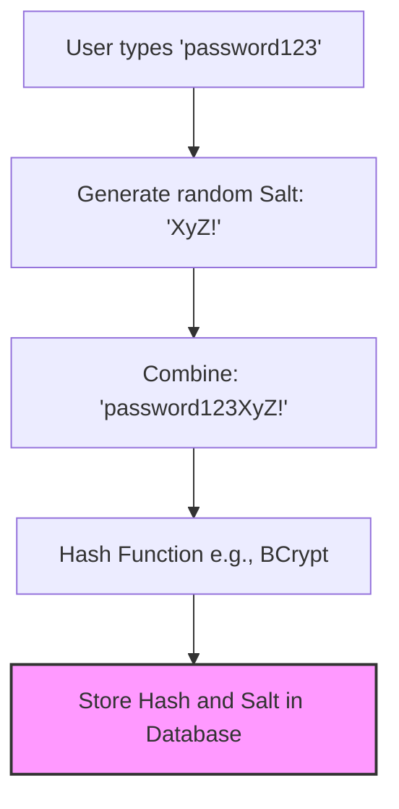
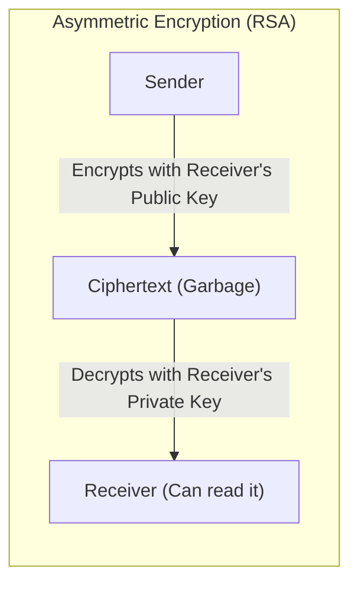
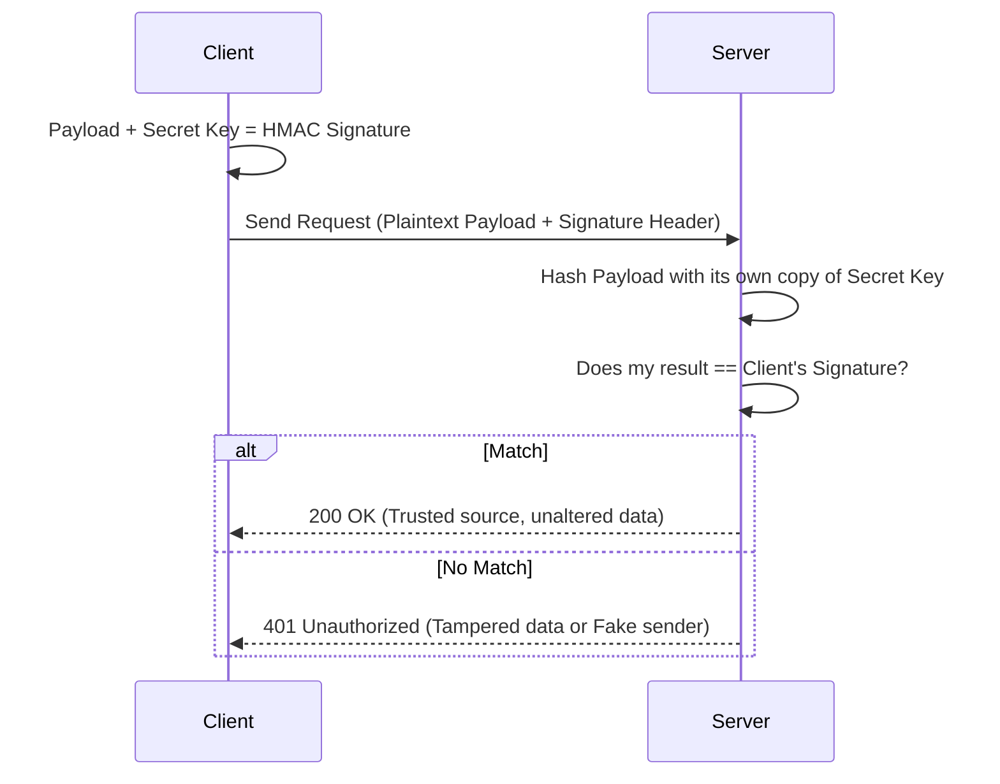

# Cryptography Masterclass: Encryption, Hashing, & Signatures

## 1. The Core Concept: One-Way vs. Two-Way
The single biggest mistake candidates make in interviews is using the words "hashing" and "encryption" interchangeably. They are completely different concepts.

*   **Hashing (One-Way):** You turn data into a scrambled string, but you **can never mathematically reverse it**. You can't get the original data back.
*   **Encryption (Two-Way):** You turn data into a scrambled string, but you **can unlock it** to get the original data back if you have the correct key.

---

## 2. Hashing & Salting (One-Way)
### What is Hashing?
A hash function takes an input of any size and returns a fixed-size string of characters. 
*Rule:* The same input will *always* produce the exact same output. 
*   **Common Algorithms:** SHA-256, BCrypt, Argon2.
*   **When to use it:** Verifying file integrity, or storing user passwords (because even if the database is hacked, the hacker can't reverse the hashes back into plain-text passwords).

### Why do we need "Salting"?
If two users have the same password (`password123`), their hashed outputs will be identical. Hackers use "Rainbow Tables" (massive databases of pre-computed hashes for common passwords) to instantly reverse-engineer simple passwords.

A **Salt** is a random string added to the password *before* hashing it.
`Hash("password123" + "random_salt_84Xy") = "8f4e2..."`
Now, even if two users have the same password, their hashes will be completely different. A new, unique salt is generated for every single user.

---

## 3. Encryption (Two-Way)
If you need to retrieve the original data later (e.g., a user's credit card number, or sending an email), you use encryption. There are two main types:

### A. Symmetric Encryption (The Single Key)
You use the **exact same key** to lock and unlock the data.
*   **Industry Standard:** AES (Advanced Encryption Standard). Specifically, AES-256-GCM.
*   **Pros:** Extremely fast. Great for encrypting massive amounts of data (like files or database columns).
*   **Cons:** Key distribution. If you send the locked box and the key to your friend over the internet, a hacker intercepting the traffic can steal both.
*   **When to use it:** Encrypting data at rest (like encrypting your `bvn_clients` private keys in the DB), encrypting files, or when both sides already securely share a secret.

### B. Asymmetric Encryption (The Key Pair)
You generate two keys: a **Public Key** (which you give to everyone) and a **Private Key** (which you keep secret).
*   **Rule:** If you lock data with the Public Key, ONLY the Private Key can unlock it.
*   **Industry Standard:** RSA, ECC (Elliptic Curve Cryptography).
*   **Pros:** Solves the key distribution problem. Anyone can send you a secure message using your public key, but only you can read it.
*   **Cons:** Very slow. It is mathematically too heavy to encrypt large amounts of data.
*   **When to use it:** Establishing secure connections (HTTPS/TLS), Digital Signatures.

---

## 4. Hybrid Encryption (The Best of Both Worlds)
Because RSA is too slow for large data and AES has the "key distribution" problem, modern systems (like your Ecobank NIBSS integration) use a hybrid approach:
1. The Sender generates a fast, temporary AES key.
2. The Sender encrypts the massive JSON payload with the AES key.
3. The Sender encrypts the *AES Key itself* using the Receiver's RSA Public Key.
4. The Sender sends both the encrypted payload and the encrypted AES key. The Receiver uses their RSA Private Key to unlock the AES key, then uses the AES key to unlock the payload.

---

## 5. HMAC (Hash-Based Message Authentication Code)
Encryption hides data. But how do you prove *who* sent it? How do you prove the data wasn't tampered with in transit?

HMAC is used for **Integrity** and **Authentication** (like your API Client Management module for Machine-to-Machine communication).
*   Both the sender and receiver share a secret key.
*   The sender hashes the payload combined with the secret key and attaches the result (the "signature") to the request header.
*   The receiver takes the payload, hashes it with the same secret key, and checks if their calculated signature matches the client's signature.
*   *Note:* The payload itself is usually sent in plain text! HMAC doesn't hide the data; it just proves nobody altered it and that the sender holds the secret key.

---

## 6. Summary Cheat Sheet for Interviews

| Goal | What to use | Algorithm Examples | Real World Example |
| :--- | :--- | :--- | :--- |
| **Hide a Password** | Hashing + Salting | BCrypt, Argon2, SHA-256 | User login database |
| **Encrypt Large Data quickly** | Symmetric Encryption | AES-256 | Encrypting a hard drive or DB column |
| **Securely exchange keys** | Asymmetric Encryption | RSA, ECC | HTTPS/TLS handshake |
| **Prove who sent an API request** | HMAC Signatures | HMAC-SHA256 | Machine-to-Machine Auth, Webhooks |
| **Send large data securely over the internet** | Hybrid Encryption | AES + RSA | NIBSS BVN Integration |
