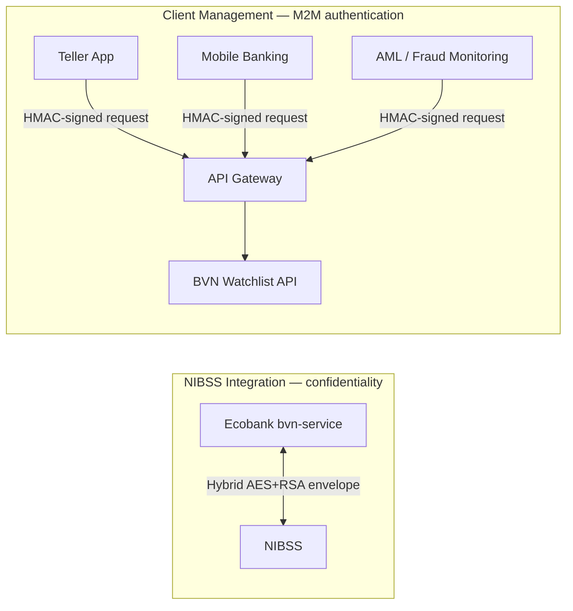
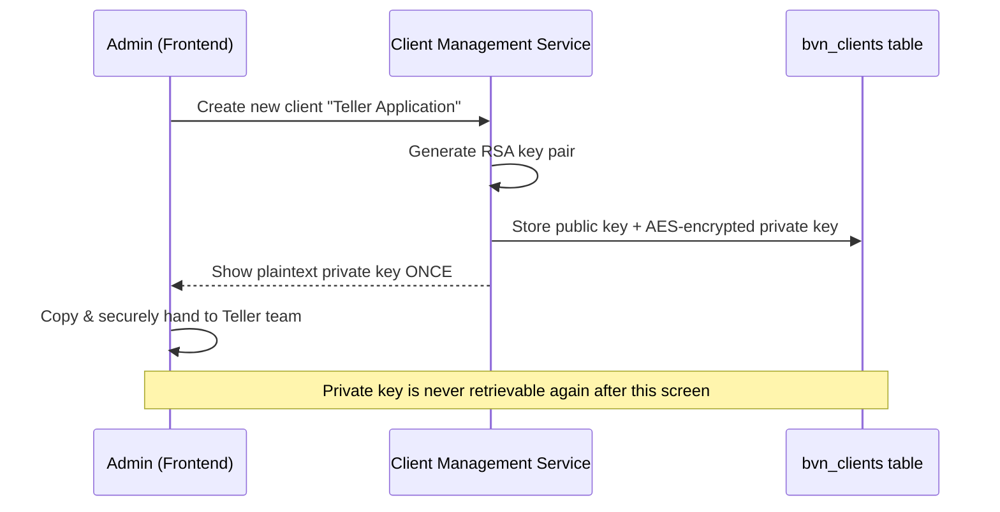
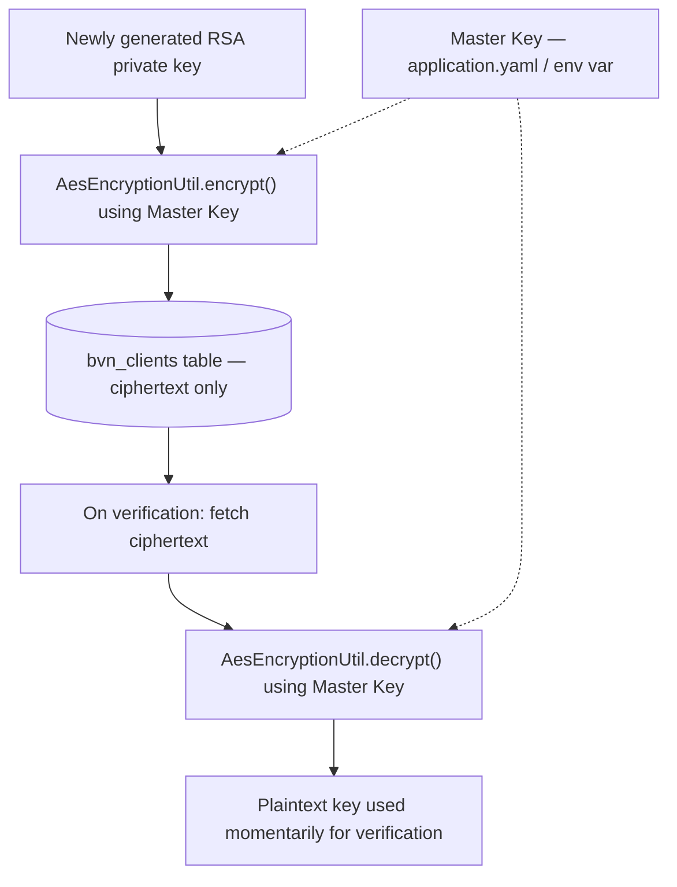
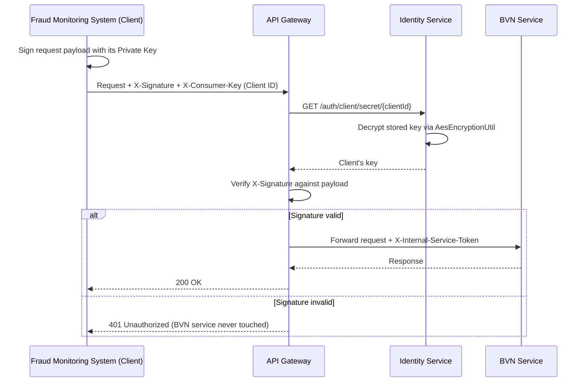
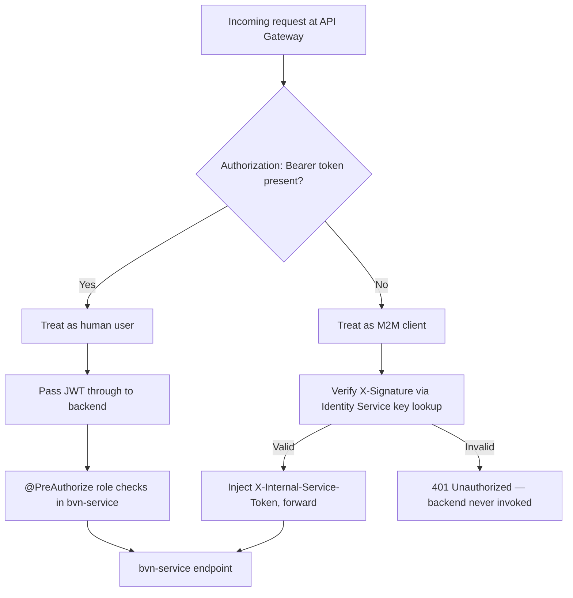

# API Client Management (CLM) & M2M Authentication — HMAC Signatures

## The core confusion this note resolves
The BVN Watchlist service actually has **two completely separate encryption/authentication schemes**, and it's easy to conflate them:

| | NIBSS Integration (`NibssCryptoServiceImpl`) | API Client Management (Mautin's module) |
|---|---|---|
| **Who talks to whom** | Ecobank ↔ NIBSS | Other Ecobank/3rd-party systems ↔ our BVN Watchlist API |
| **Mechanism** | Hybrid encryption (AES + RSA envelope) | RSA key pair + HMAC digital signatures |
| **Solves** | Confidentiality of payloads over the wire | Machine-to-Machine (M2M) authentication |
| **Where it lives** | `bvn-service` crypto package | `common-lib` + API Gateway + `identity-service` |

Keep them mentally separate — **you don't plug one into the other.**

---

## 1. Why does an M2M auth layer exist at all?

The BVN Watchlist exposes APIs (e.g. `/api/v1/watchlist/check`). Other internal systems will eventually need to call them:

- The **Teller Application** (cashier checks a BVN before a withdrawal)
- The **Mobile Banking backend** (customer opens a new account)
- The **AML / Fraud Monitoring system** (bulk background checks) — this one is real and was raised at the Design Forum for future integration

**The problem:** there's no human typing a username/password for these calls. You need a way to prove a request genuinely came from an authorized *system*, not a rogue script.

**The solution — Client Management (CLM):** every consuming application is registered as a "Client." An admin creates a client, the system generates a unique RSA key pair for it, and the plaintext private key is shown **exactly once** on creation (with a warning to copy and securely hand it to the consuming team).

---

## 2. Why is the private key stored encrypted (`AesEncryptionUtil`)?

Once generated, the client's RSA key pair has to be persisted in the `bvn_clients` table so the system can verify future requests. Storing it in plaintext means a single DB dump exposes every client's credentials.

`AesEncryptionUtil` (AES-256-GCM) acts as a **master vault**:
1. A single Master Key lives in environment config (`application.yaml`) — never in the DB.
2. Before saving a client's key, `encrypt()` locks it with the Master Key.
3. When verification is needed, the encrypted key is pulled from the DB and `decrypt()`'d using the Master Key.

This is unrelated to NIBSS's per-request AES session keys — this AES key is long-lived and purely protects data-at-rest.

---

## 3. How does the external system actually call our endpoints? (HMAC flow)

Verification happens at the **API Gateway**, not inside individual controllers.

Step by step:
1. **Sign** — the client signs its request payload with the private key it was issued, and sends the signature in `X-Signature`, plus its `Client ID` in `X-Consumer-Key`.
2. **Gateway intercepts** — a `SignatureVerificationFilter` at the Gateway catches every inbound call.
3. **Fetch the key** — the Gateway calls the Identity Service (`/api/v1/auth/client/secret/{clientId}`), which decrypts the stored key via `AesEncryptionUtil`.
4. **Verify** — the Gateway checks the signature. Bad signature → immediate `401`, the BVN Service is never even invoked.
5. **Forward with trust token** — on success, the Gateway injects an internal token (e.g. `X-Internal-Service-Token`) and forwards to `bvn-service`.

---

## 4. Does this bypass RBAC? How does it coexist with human JWT auth?

**No bypass — it's a parallel authentication path, not a replacement.**

- **Human users**: log in via the frontend, get a **JWT (Bearer token)** carrying roles (`ROLE_MAKER`, `ROLE_CHECKER`). Controllers enforce this with `@PreAuthorize("hasRole('MAKER')")`.
- **API Clients (machines)**: have no JWT — they authenticate via HMAC signature at the Gateway instead.

**How the Gateway decides which path to apply:**
- If the request carries `Authorization: Bearer <token>` → treated as a human, JWT passed straight through to the backend for normal RBAC checks, HMAC check skipped.
- If there's no JWT → treated as an M2M client, HMAC signature verification runs instead.
- Either way, once past the Gateway, the backend endpoint only needs to trust the internal token / validated JWT it receives — it doesn't need to know *how* the caller was authenticated upstream.

**Revocation — the actual point of the whole design:** if a hacker steals the Teller Application's key, an admin just **deactivates or rotates keys** for that one client. Every other client (Mobile Banking, AML) keeps working — nothing else is affected.

---

## 5. What does this mean for future endpoints?

Any new endpoint exposed through the API Gateway is **automatically** covered by this M2M layer — no manual per-endpoint work required. The existing `BvnInboundController` / `BvnOutboundController` endpoints (the ones a future Fraud Monitoring integration would consume) will be protected the moment the Gateway patch is active, with zero changes to controller code. The Gateway absorbs all the signature-verification complexity; the backend just trusts what it's handed.

---

## Interview Answer

**"Explain the API Client Management module and how it authenticates machine-to-machine traffic."**

"This module solves Machine-to-Machine authentication — proving that a request to our BVN Watchlist API genuinely came from an authorized system, like a Teller Application or a Fraud Monitoring system, rather than a human with a username/password. It's completely separate from our NIBSS hybrid-encryption integration; that one protects payload confidentiality between Ecobank and NIBSS, while this one is about authenticating *who's calling our API*.

When an admin registers a new client, the system generates an RSA key pair for it and shows the private key exactly once. That key is stored encrypted at rest using an AES-256-GCM master vault, so a database compromise alone doesn't leak client credentials. At request time, the client signs its payload with its private key and sends the signature in a header. Our API Gateway intercepts the request, fetches and decrypts the client's key via the Identity Service, and verifies the signature — rejecting with a 401 before the request ever reaches the backend if it fails. On success, the Gateway forwards the request with an internal trust token.

This coexists with our existing JWT/RBAC model rather than bypassing it: human traffic carries a JWT and goes through normal role-based checks; machine traffic has no JWT and goes through HMAC verification at the Gateway instead. The real operational win is revocation — if one client's key is compromised, we deactivate or rotate just that client without affecting any other integration."

---

## Quick Summary
- Two independent systems: NIBSS hybrid encryption (confidentiality) vs Client Management (M2M authentication) — never merge them.
- `AesEncryptionUtil` = master vault for encrypting client RSA keys **at rest** in the DB, using one long-lived master key from env config.
- External clients authenticate via **HMAC signature verification at the API Gateway**, not inside individual controllers.
- Humans → JWT + RBAC. Machines → HMAC signature + internal trust token. The Gateway routes between the two based on presence of a `Bearer` token.
- Revocation/rotation is per-client — compromising one client's key doesn't affect others.
- Future endpoints behind the Gateway inherit this protection automatically — no per-endpoint changes needed.
