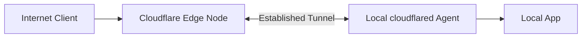
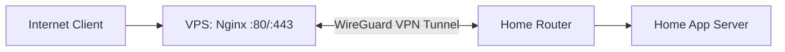
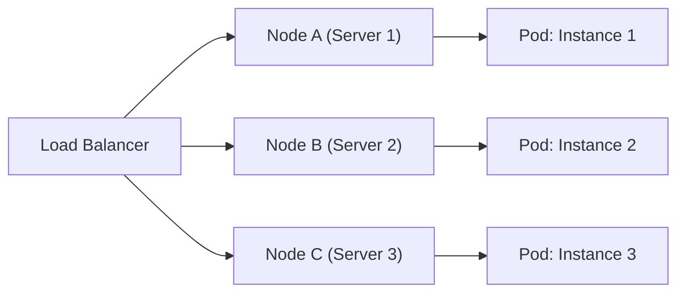
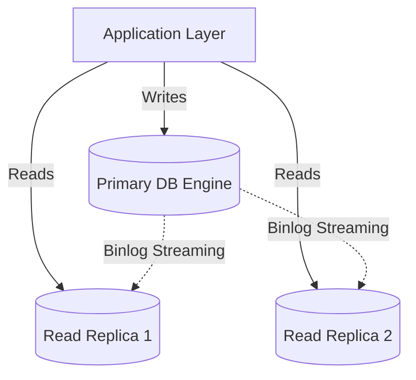
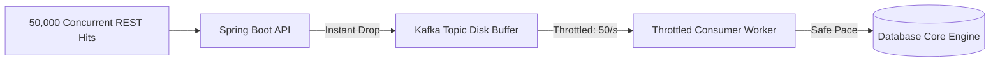
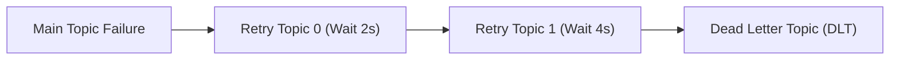
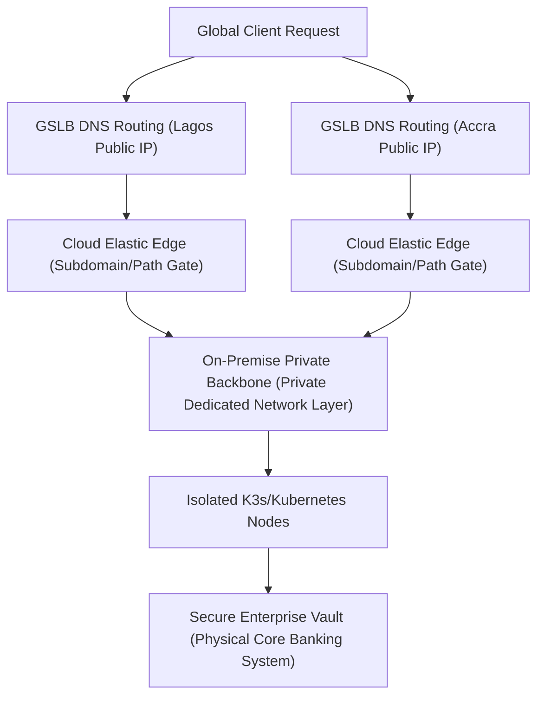

# Architectural Blueprint: From Local Home Labs to Enterprise-Grade Resilience

This guide provides a comprehensive roadmap for evolving an application from a basic, single-machine setup to a highly distributed, enterprise-grade architecture capable of handling high-volume traffic spikes and systemic infrastructure failures.

---

## Phase 0 — IP Fundamentals: What You're Actually Working With

Before touching orchestration or scaling, it helps to understand the raw material: what a public IP address actually is, why VPS providers can hand you one so cheaply, and what your realistic options are for getting one attached to a home server.

### Do You Get Your Own IP with a VPS?

Yes. A Virtual Private Server (VPS) provider assigns you a dedicated, static public IP (IPv4 and/or IPv6) that's unique to your server — you don't share it. The provider's virtualization layer (KVM, VMware) provisions an isolated virtual machine on physical hardware and gives it a direct public IP, which you point your domain's DNS `A` record at.

### Why Is It So Cheap?

The IP itself isn't expensive to *you* — hosting providers buy IPv4 space in bulk and bundle the first IP into your base subscription. That's how providers like DigitalOcean or IONOS can rent a full VPS, dedicated IP included, for $2–$6/month. Extra IPs on the same server cost a small line-item fee ($1.50–$4/month) because global IPv4 addresses are genuinely scarce. IPv6-only VPS instances sidestep that scarcity entirely and can run under $1/month.

### Three Ways to Get a Static IP for a Home Server

| Option | How it works | Cost |
| --- | --- | --- |
| **Official ISP route** | Call your ISP, upgrade to a static IP | Usually forces a Business Internet Plan — $20–$100+/month extra, plus a $5–$15/month static-IP fee |
| **Dynamic DNS (DDNS)** | A lightweight daemon on your home server (via DuckDNS, No-IP) updates a domain name every time your ISP rotates your public IP | Free |
| **VPS Reverse Proxy / WireGuard Tunnel** | Rent a $2/month VPS for its static IP, tunnel traffic home over WireGuard | $2–$5/month |

DDNS is the right call if you just need a *reliable, reachable hostname* and don't strictly need the number itself to stay fixed. The VPS tunnel is the right call if your ISP uses CGNAT (shared IP, no port-forwarding possible) or you want a clean static entry point without a business contract.

### IPv6: The Free, NAT-less Option

IPv6 sidesteps the whole scarcity problem. Instead of one IP for your router, your ISP typically hands your home an entire **prefix** (a /56 or /64 block) — a /64 alone contains 18.4 quintillion addresses, enough to give every device in your house its own globally routable IP with no NAT required. Most fiber/cable ISPs bundle this for free; whether it's static or dynamic depends on whether your ISP reassigns the prefix on router reboot (if dynamic, an IPv6-aware DDNS service handles it the same way as IPv4).

**The catch:** only users on an IPv6-capable network can reach an IPv6-only host — roughly 40–50% of global traffic still can't. The common workaround is a free Cloudflare Tunnel, which presents an IPv4-compatible front to the internet while routing traffic to your home server over IPv6 on the back end.

---

## Phase 1 — Zero to One: The Single Home Server

### The Core Problem

You have built a backend application (such as a Spring Boot API) and a frontend dashboard (such as a React or Next.js app) running smoothly on `localhost`. Now, you want to expose this application to the public internet using your own physical home hardware without upgrading to an expensive commercial business ISP contract or risking your residential security.

### Technical Breakdown: The Routing Dilemma

Residential Internet Service Providers (ISPs) actively rotate your public IP address (Dynamic IP) and routinely block common inbound ports (like `80` and `443`). Furthermore, many modern ISPs place residential clients behind Carrier-Grade NAT (CGNAT), sharing a single public IP among thousands of households, making direct inbound port-forwarding impossible.

#### Path A: The Cloudflare Tunnel (Easiest & Free)

Instead of opening your home router's ports to the internet, you execute an outbound connection by running a lightweight background daemon (`cloudflared`) directly on your machine. This daemon builds an encrypted outbound tunnel to Cloudflare's edge nodes.



* **The Mechanic:** Incoming web traffic hitting your domain is captured by Cloudflare and securely funneled down the existing outbound connection straight to your local port.
* **The Advantage:** Your public home IP address stays entirely hidden from the internet, completely bypassing CGNAT and ISP firewall blocks without manual port adjustments.

#### Path B: The $2 VPS Reverse Proxy (Total Control)

You lease an entry-level Virtual Private Server (VPS) from a cloud provider solely to obtain its dedicated, static public IPv4 address.



* **The Mechanic:** You establish a permanent WireGuard VPN tunnel connecting your home infrastructure up to the cloud VPS. You configure an Nginx instance on the VPS to listen on ports `80`/`443` and proxy all incoming web requests down through the VPN interface to your home hardware.
* **The Advantage:** Zero third-party inspection. You maintain complete end-to-end encryption control over the payloads.

### Step-by-Step Implementation

1. **Enforce Static Local Addressing:** Configure your home router's DHCP reservation system to bind your server's MAC address to a permanent internal IP (e.g., `192.168.1.50`). This prevents server restarts from breaking internal network routing.
2. **Establish the Public Gateway:** Point your custom domain's nameservers to your proxy edge. If utilizing Cloudflare, initialize a new tunnel in the Zero Trust console, execute the provided platform installation script on your home host, and bind your public hostname directly to your local application port:
   * **Public Hostname:** `dashboard.mycoolapp.com`
   * **Service Routing:** `HTTP://192.168.1.50:8080`
3. **Harden System Recovery:** Boot your machine's system BIOS and modify the `AC Power Recovery` parameter to **Power On**. This guarantees that if a regional power failure occurs, the server automatically boots itself back up and re-establishes its cloud tunnels the moment power returns.

> **Improvement — UPS + Watchdog:** BIOS auto-power-on protects against a full outage-then-restore cycle, but a dirty shutdown mid-write can still corrupt a database. Pair this with a small UPS (even a 10–15 minute battery) and a watchdog script that triggers a graceful `systemctl stop` sequence on low battery, rather than relying purely on the wall socket coming back.

---

## Phase 2 — One to Many: Moving to Multi-Node Compute Clusters

### The Core Problem

Relying on a single physical host creates a single point of failure (SPOF). If a motherboard shorts, a drive corrupts, or a system update hangs, your entire application goes down.

### Technical Breakdown: Container Orchestration

To move past individual server management, you combine multiple physical machines into a unified resource pool managed by a container orchestrator. You stop deploying directly to specific machines; instead, you declare your desired state to the orchestrator's controller API.



#### Orchestrator Comparison Matrix

| Capability | Docker Swarm | Kubernetes (K8s) | K3s (Recommended for Mini-Data Centers) |
| --- | --- | --- | --- |
| **Footprint/Resource Cost** | Minimal (Built into Docker) | Heavy (~1-2GB RAM overhead per node) | Ultra-lightweight (<500MB RAM overhead) |
| **Complexity Profile** | Low (Very easy to adopt) | Extremely High (Steep learning curve) | Medium (Standard K8s APIs, packaged cleanly) |
| **Self-Healing Automation** | Basic container restarts | Advanced auto-scheduling and recovery | Full cloud-native self-healing |

### Step-by-Step Integration: Ingress vs. Service

When operating across a multi-node cluster, applications are decoupled into **Pods** (disposable running instances). Because pods are ephemeral, their internal IPs change constantly on restart. Kubernetes manages this network abstraction using two distinct components:

1. **The Ingress (The External Gatekeeper):** Sits at the edge of your cluster to receive inbound traffic from your network tunnel. It evaluates the incoming HTTP request path or hostname and routes it appropriately.
2. **The Service (The Internal Traffic Cop):** Sits between the Ingress and the Pods. It maintains a stable internal DNS name (e.g., `http://backend-service`) and handles health-checked load balancing across all active pods matching its selector labels, regardless of which physical node they live on.


> **Improvement — Autoscaling:** Once you're on K8s/K3s, pair the Service layer with a **Horizontal Pod Autoscaler (HPA)** driven by CPU/memory metrics, or **KEDA** if you want to scale off Kafka lag or queue depth (very relevant once Phase 4 is in play). Otherwise "multi-node" just gives you fixed redundancy, not elasticity.

### Do You Need One Public IP per Server?

No — **you only need one public IP for the entire cluster**, regardless of how many physical nodes are behind it. You point that single IP (from your Cloudflare tunnel or VPS) at the cluster's **Ingress Controller** (a specialized load balancer running inside Kubernetes, such as Traefik or Nginx). The Ingress Controller then reads the hostname or path on each incoming request and fans it out internally:

* `api.mydatacenter.com` → routed to the backend Service
* `dashboard.mydatacenter.com` → routed to the frontend Service

Ten physical machines running a dozen different apps can sit behind that one public front door without the outside world ever knowing how many nodes are back there. (At real enterprise scale, this evolves into dedicated edge hardware — an F5 BIG-IP or Citrix ADC-class API gateway — sitting in front of multiple *clusters*, using the same subdomain/path-routing logic described in Phase 6.)

---

## Phase 3 — High-Traffic Backend Engineering

### The Core Problem

While stateless application instances can scale up horizontally to meet demand, the stateful database layer cannot simply be duplicated on the fly. High concurrent user traffic will quickly saturate database compute pools, causing slow queries, thread exhaustion, and eventual database crashes.

### Technical Breakdown: The Data Layer Defenses

#### Defense 1: Read/Write Splitting & Replica Arrays

Because standard web traffic patterns are heavily biased toward read actions (~90% reads, ~10% writes), you isolate database workloads. You run a single **Primary Database Engine** dedicated purely to processing write changes and transactional mutations.

This primary node streams binary log mutations to an array of **Read Replicas**. Your application infrastructure routes all data-fetching requests to the replicas, leaving the primary node unburdened.



#### Defense 2: Application Connection Tuning (HikariCP)

Opening raw network connections to a database engine is computationally expensive. Spring Boot applications leverage **HikariCP** to maintain a warm pool of reusable connections.

For high-volume throughput, massive connection pools are a performance trap; they cause intense CPU context-switching on the database engine. A compact, highly optimized pool maximizes database efficiency.

```yaml
spring:
  datasource:
    hikari:
      maximum-pool-size: 15        # Fixed execution channels to avoid DB context switching
      minimum-idle: 5              # Warm backup channels ready for instant traffic spikes
      connection-timeout: 5000     # Reject hanging clients after 5s to avoid thread backlogs
      max-lifetime: 1800000        # Refresh connections every 30 mins to clean leaky sockets
```

#### Defense 3: Edge In-Memory Caching

To keep read requests from hitting your database replicas in the first place, place an in-memory key-value store like **Redis** directly in front of your application. High-frequency queries serve data out of RAM in microseconds, shielding your primary data stores.

#### Defense 4: Sharding (When One Primary Isn't Enough)

Read replicas, caching, and connection pooling all assume a single Primary can still handle 100% of writes. At true hyperscale — the volume a company like Uber or Facebook sees — even that assumption breaks. **Sharding** splits the Primary itself into multiple independent databases, each owning a slice of the data:

* Database A handles accounts ending in `0–4`
* Database B handles accounts ending in `5–9`

Each shard runs on entirely separate physical hardware, so writes scale horizontally instead of being bottlenecked by one machine's I/O ceiling. This is a last resort, not a first move — it adds real complexity (cross-shard queries and transactions become hard problems) and should only be reached for after read/write splitting, caching, and pooling are already maxed out.

> **Improvement — Cache invalidation strategy:** Redis-in-front-of-DB is easy to reason about until a write happens. Pick an explicit pattern up front — **cache-aside with TTL** for most read-heavy endpoints, or **write-through** for data that can't tolerate staleness (e.g., account balances) — rather than defaulting to "cache everything and hope." For a banking-adjacent system, treat any monetary field as write-through or no-cache by default.

> **Improvement — Connection pool sizing formula:** Rather than picking `maximum-pool-size` arbitrarily, HikariCP's own guidance is roughly `pool_size = Tn * (Cm - 1) + 1`, where `Tn` is the number of threads and `Cm` is the number of simultaneous connections held per thread (usually 1). Size it against your actual DB core count and thread pool, not a round number.

---

## Phase 4 — Async Shock Absorption: Traffic Flattening via Kafka

### The Core Problem

During a massive traffic surge, thousands of users may execute write transactions simultaneously. If these hits push past the physical capacity of your primary database node, the connection pools saturate, transactions timeout, and the system experiences a cascade failure.

### Technical Breakdown: Asynchronous Event Streams

To protect your system from crashing during unexpected traffic spikes, convert your synchronous REST APIs into an **Event-Driven Asynchronous Architecture** using Apache Kafka.

Instead of forcing your HTTP thread to wait for a database write to complete, your web worker converts the payload into an immutable event record, publishes it to a Kafka topic, and instantly returns a successful HTTP response (`202 Accepted`) back to the client.



### Core Java Implementation: The Throttled Consumer

This Spring Boot implementation uses a token-bucket rate limiter to enforce strict backpressure, processing entries from the Kafka topic only as fast as the database can safely handle.

```java
import com.google.common.util.concurrent.RateLimiter;
import org.springframework.kafka.annotation.KafkaListener;
import org.springframework.stereotype.Service;

@Service
public class TransactionConsumer {

    private final TransactionRepository transactionRepository;

    // Explicitly clamp database execution to a maximum of 50 operations per second
    private final RateLimiter rateLimiter = RateLimiter.create(50.0);

    public TransactionConsumer(TransactionRepository transactionRepository) {
        this.transactionRepository = transactionRepository;
    }

    @KafkaListener(topics = "account-transactions", groupId = "banking-core-processor")
    public void processTransaction(String transactionPayload) {

        // Enforces backpressure. If the queue is running hot, this call blocks the
        // local execution thread to match the requested 50/s throughput.
        rateLimiter.acquire();

        try {
            transactionRepository.save(new TransactionEntity(transactionPayload));
        } catch (Exception ex) {
            System.err.println("Database ingestion failure: " + ex.getMessage());
            throw ex; // Re-throw to kick off the failure recovery pipeline
        }
    }
}
```

> **Improvement — Idempotency:** A `202 Accepted` response pattern combined with `@KafkaListener` retries (Phase 5) means a message can be redelivered and processed twice. Add an idempotency key (e.g., a client-supplied UUID or a hash of the payload) checked against a unique DB constraint or a short-lived Redis `SETNX` lock before the `save()` call, or you risk double-processing a transaction during a retry storm.

> **Improvement — Partitioning key choice:** For `account-transactions`, key messages by account ID (not randomly) so all events for a given account land on the same partition and are processed in order. Otherwise a debit and a credit for the same account could race across two consumer threads.

---

## Phase 5 — Resilient Recovery: Self-Healing Pipelines

### The Core Problem

When consumer tasks execute asynchronously in the background, a temporary database disconnection or network blip could cause a message batch to fail. Simply dropping the message results in lost data, while letting the application crash halts the entire processing pipeline.

### Technical Breakdown: Non-Blocking Retries and DLT

To handle failures gracefully without blocking the entire queue, implement non-blocking retries with a Dead Letter Topic (DLT). If a message processing attempt fails, it moves to an isolated retry queue with an exponential backoff delay, freeing up the main thread to continue processing healthy incoming traffic.



### Java Resiliency Implementation

```java
import org.springframework.kafka.annotation.DltHandler;
import org.springframework.kafka.annotation.KafkaListener;
import org.springframework.kafka.annotation.RetryableTopic;
import org.springframework.kafka.support.KafkaHeaders;
import org.springframework.messaging.handler.annotation.Header;
import org.springframework.retry.annotation.Backoff;
import org.springframework.stereotype.Service;

@Service
public class ResilientTransactionConsumer {

    private final TransactionRepository transactionRepository;

    public ResilientTransactionConsumer(TransactionRepository transactionRepository) {
        this.transactionRepository = transactionRepository;
    }

    @RetryableTopic(
        attempts = "4",
        backoff = @Backoff(delay = 2000, multiplier = 2.0),
        autoCreateTopics = "true"
    )
    @KafkaListener(topics = "secure-transfers", groupId = "ledger-sync-group")
    public void consumeLedgerEntry(String payload) {
        // If a transient database infrastructure error is thrown here, the framework
        // intercepts it and routes the payload out of the main execution stream.
        transactionRepository.save(new TransactionEntity(payload));
    }

    @DltHandler
    public void handlePermanentFailure(String payload,
                                       @Header(KafkaHeaders.EXCEPTION_MESSAGE) String error,
                                       @Header(KafkaHeaders.RECEIVED_TOPIC) String sourceTopic) {
        // Executed only after all 4 retry efforts are exhausted.
        System.err.println("DLQ Alert: Critical transaction isolate from topic: " + sourceTopic);
        System.err.println("Root Cause Exception String: " + error);

        // Enterprise Next Step: Write payload out to an isolated operational store
        // and trigger immediate notifications for manual engineer intervention.
    }
}
```

> **Improvement — Circuit breaker before retry:** `@RetryableTopic` handles message-level retries well, but if the *database itself* is down, hammering it with 4 retries per message across thousands of in-flight messages compounds the outage. Wrap the `save()` call with a circuit breaker (Resilience4j) so that once failures cross a threshold, the circuit opens and messages route straight to a "paused" state or the DLT immediately, rather than each one individually waiting out its own backoff against a database that's still down.

> **Improvement — DLT alerting, not just logging:** `System.err.println` on DLQ alert won't page anyone at 2am. Wire the `@DltHandler` to an actual alert path — Prometheus Alertmanager, a Slack/Teams webhook, or PagerDuty — since a silently growing DLT in a banking transaction pipeline is a compliance and reconciliation risk, not just an ops nuisance.

---

## Phase 6 — Enterprise Scale: The Blueprint

### The Core Problem

When scaling up to support multinational corporate services, operations grow beyond single clusters or cloud instances. Strict data privacy laws and financial regulations often mandate that primary client records remain inside local physical borders, while web interfaces must scale elastically across public clouds.

### The Architecture: Hybrid Cloud Topology

Enterprise topologies split core business logic into a **Hybrid Cloud Architecture**. Public cloud instances manage volatile, high-frequency user traffic, while local, secure data centers process sensitive data in complete isolation.



1. **Global Server Load Balancing (GSLB):** Inbound traffic is not sent to a single IP address. Instead, intelligent DNS resolution routes users based on their health status and geographic proximity, instantly shifting traffic to healthy servers if a regional data center goes dark.
2. **Context-Path / Subdomain Edge Routing:** A primary corporate domain splits complex workloads across isolated, dedicated infrastructure clusters behind a secure edge network layer:
   * `retail.ecobank.com` → Retail Banking Micro-Cluster
   * `corporate.ecobank.com` → Corporate Banking Infrastructure
   * `ecobank.com/api/v1/transact` → Core Payment API Processing Engine
3. **Strict Blast Radius Isolation:** By partitioning systems into independent, purpose-built Kubernetes clusters, a catastrophic deployment failure within one business unit (like a retail interface update) cannot crash unrelated business operations (like corporate services or core ledger APIs).
4. **Continuous GitOps Reconciliation:** To eliminate manual human error, clusters are locked down. Direct command-line interaction is disabled. Instead, declarative system configurations are tracked in secure Git repositories. Automation controllers (like ArgoCD) continuously monitor these repositories, instantly pulling down updates and fixing any unauthorized configuration changes to keep the live cluster perfectly aligned with your code.

> **Improvement — Secrets management:** GitOps solves config drift but introduces a new problem: secrets can't live in plaintext in Git. Pair ArgoCD with a secrets layer like **HashiCorp Vault** or **Sealed Secrets**, so encrypted values are safely committed and only decrypted inside the cluster.

> **Improvement — mTLS / service mesh:** At this scale, service-to-service traffic inside the private backbone should not be implicitly trusted just because it's "internal." A service mesh (Istio or Linkerd) gives you mutual TLS between pods, fine-grained traffic policies, and per-service observability without changing application code — increasingly a baseline expectation for regulated financial infrastructure.

> **Improvement — Progressive delivery:** Layer canary or blue-green rollouts (Argo Rollouts, Flagger) on top of GitOps so a bad deploy is caught against a small percentage of live traffic and auto-rolled-back on error-rate/latency thresholds, instead of a full-cluster cutover.

---

## The Interview Quick-Reference Cheat Sheet

### Summary of System Evolution

| Architectural Stage | Primary Core Problem | System Solution |
| --- | --- | --- |
| **Stage 0: IP Fundamentals** | Residential ISPs rarely offer affordable static IPv4. | **DDNS** (free) for a stable hostname, or a **cheap VPS static IP** ($2–5/mo); **IPv6** as a NAT-free alternative where reachability allows. |
| **Stage 1: Home Lab** | Dynamic IP rotation, open port firewalls, and CGNAT blocks. | **Cloudflare Outbound Tunnels** or **VPS Reverse Proxy** nodes. |
| **Stage 2: Multi-Node** | Single host machines creating single points of failure (SPOF). | **K3s/Kubernetes Cluster Orchestration** separating Ingress and Services. |
| **Stage 3: Data Scaling** | Database computational collapse under heavy concurrent load. | **Read/Write splitting**, **Redis caching**, and optimized **HikariCP** allocation. |
| **Stage 4: Asynchronous Operations** | Inbound connection pools exhausting during sudden transaction spikes. | **Kafka Topic Buffering** using programmatic consumer rate-limiting. |
| **Stage 5: High Resiliency** | Failed background operations stalling or blocking consumer loops. | **Non-blocking `@RetryableTopic`** mechanics moving items to a **DLQ/DLT**. |
| **Stage 6: Enterprise Scale** | Compliance with local data residency regulations while scaling dynamically. | **Hybrid Cloud Architectures** using geographic **GSLB** and **GitOps**. |

### Verbatim System Design Interview Answers

> **How do you handle a database write bottleneck during high traffic spikes?**
>
> "To scale stateful write layers during high traffic spikes, you must decouple the synchronous HTTP thread from the physical database write. I implement an event-driven asynchronous pattern using Apache Kafka as a traffic flattener. The user-facing API publishes an immutable transaction payload directly into a Kafka topic disk buffer and returns an immediate response.
>
> A decoupled backend worker acts as a throttled consumer, reading events from the topic and writing them to the database at a safe, sustainable pace regulated by a token-bucket rate limiter. This introduces backpressure, protecting database connection pools from exhausting and ensuring the primary database engine never crashes under sudden load surges."

> **What is the difference between a Kubernetes Ingress and a Kubernetes Service?**
>
> "The key distinction is that Ingress handles routing traffic based on URLs at the edge of the cluster, while a Service handles load-balancing based on health at the individual container level.
>
> Ingress serves as the front entry point, reading incoming HTTP hostnames or request paths to direct traffic to the correct internal service. A Kubernetes Service functions as a permanent internal load balancer with a stable DNS name, abstracting away individual Pod instances. Because Pods are ephemeral and receive new IP addresses on restart, the Service tracks which Pods are currently healthy and distributes traffic across them seamlessly."

---

## Next Steps for Future System Consideration

As you scale this architecture further, address these components of distributed infrastructure engineering:

### 1. Distributed Storage Engines (Persistent State Management)

In an isolated multi-node cluster, if a physical server fails, the orchestrator automatically recreates your database container on a different node. However, standard local hard drives do not follow the container across the network.

* **Action Item:** Investigate distributed network block storage technologies like **Longhorn** or **Ceph**. These pool the physical hard drives of all your individual servers together, continuously replicating storage blocks over your local network. This ensures that no matter which node your application container runs on, it can instantly mount its persistent files.

### 2. Comprehensive Observability Matrices

When an application scales from a single machine to dozens of microservice containers shifting across a cluster, traditional text log files become impossible to manage manually. If a transaction slows down, finding the root cause across a distributed network is like looking for a needle in a haystack.

* **Action Item:** Implement a centralized observability system using **Prometheus** for metrics collection and **Grafana** for dashboard visualization. Use these tools to monitor real-time cluster memory allocations, connection pool saturation, and network latency. Additionally, integrate **OpenTelemetry** into your backend applications to trace individual user requests as they hop across your microservices, helping you spot performance bottlenecks instantly.

### 3. Disaster Recovery & Backup Strategy *(new)*

None of the above matters if a region goes dark and there's no recovery plan. Define and periodically **test** (not just document):

* **RPO/RTO targets** — how much data loss is acceptable (Recovery Point Objective) and how fast you must be back up (Recovery Time Objective) per system tier.
* **Automated, encrypted backups** for the primary database with point-in-time recovery (PITR), stored off-cluster and ideally off-site.
* **Regular restore drills** — a backup that has never been restored in a test is an unverified assumption, not a guarantee.

**The nightmare scenario:** local redundancy (multiple nodes, UPS batteries, dual ISPs) protects you against a single node or connection failing — it does nothing if the physical site itself is lost (fire, flood, theft). Surviving *that* requires two things working together:

1. **Stateless infrastructure via GitOps.** Every cluster config, networking rule, and deployment manifest lives as code in a remote repository (GitHub/GitLab), not on the machines themselves. If the hardware is gone, your architecture isn't — it's sitting safely in Git.
2. **The 3-2-1 backup rule for data.** Keep **3** copies of your data, on **2** different types of media (e.g., local server drives plus separate network storage), with **1** copy kept fully offsite and encrypted (synced to something like AWS S3 or Backblaze).

Combined, this means a total physical loss is a rebuild, not a catastrophe: provision new (or temporary cloud) hardware, pull your infrastructure-as-code from Git, restore the latest offsite backup, and the cluster can be live again within hours rather than being gone for good.

### 4. Security Hardening Pass *(new)*

As the architecture grows, so does the attack surface. Before declaring "enterprise-ready":

* Run container image scanning (Trivy, Grype) in CI to catch known CVEs before deploy.
* Enforce network policies at the K8s level so pods can only talk to the services they explicitly need (default-deny).
* Rotate credentials and API tokens on a schedule, especially for anything touching payment rails or core banking systems.

### 5. Cost & Capacity Governance *(new)*

Elastic infrastructure can silently become an elastic bill. Set resource requests/limits on every pod, use cluster autoscaler floor/ceiling bounds, and review Kafka retention settings (`retention.ms`, topic size) periodically — an unbounded topic buffer is a disk-cost time bomb as much as it is a resilience feature.
